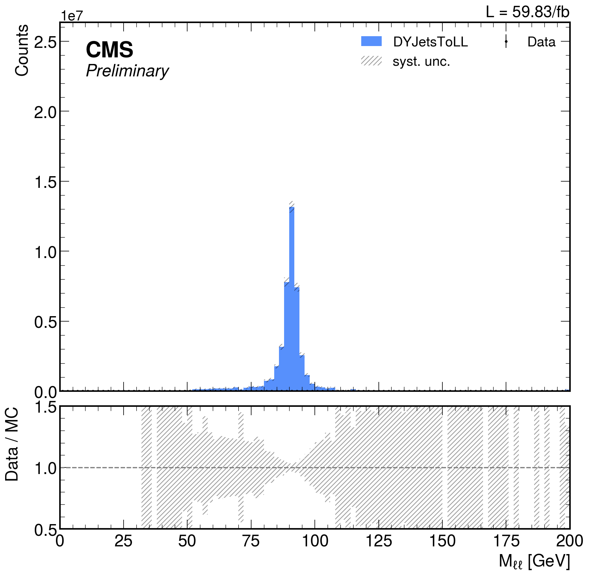

# Simple Config

In this part of the tuturial we will run a very basic analysis to look for the Zmumu peak in data and MC. 

Let's look at the content of the folder:
```bash
-rw-r--r--. 1 user zh   3.4K Nov 19 10:08 example_config.py
-rw-r--r--. 1 user zh   2.6K Nov 19 10:08 workflow.py
-rw-r--r--. 1 user zh    763 Nov 19 10:08 custom_cut_functions.py
-rw-r--r--. 1 user zh     48 Nov 19 10:08 custom_run_options.yaml
drwxr-xr-x. 2 user zh   2.0K Nov 19 10:07 datasets
drwxr-xr-x. 2 user zh   2.0K Nov 19 10:08 params
    -rw-r--r--. 1 user zh 194 Nov 19 10:08 triggers.yaml
    -rw-r--r--. 1 user zh  47 Nov 19 10:08 plotting.yaml
    -rw-r--r--. 1 user zh 316 Nov 19 10:08 object_preselection.yaml

-rw-r--r--. 1 user 1000   17 Nov 19 10:08 README.md

```

- `example_config.py` is the main configuration file for the analysis. It contains the definition of the datasets, the
  cuts, the variables to plot, etc.
- `workflow.py` contains the code customizing the analysis workflow. It is used to define the custom object cleaning
  steps and other custom analysis steps. In this particular example it is minimal.
  
- `params` is a folder containing the parameter files for the analysis. The files defining the object preselections, the
  triggers and the plotting configuration
  
- `datasets` is a folder containing the datasets used in the analysis. The datasets are defined in json files defined in
  the first part of the tutorial. 
  
- `custom_cut_functions.py` contains the custom cut functions used in the analysis.
- `custom_run_options.yaml` contains the custom run options for the analysis. It is used to define the number of events
  to process, the number of threads to use, etc.
  
## The config file

In PocketCoffea the analysis is steered by a configuration file. The configuration file is a python file that defines
a `Configurator` object. The configurator contains all the information necessary to customize: 

- the workflow applied to the events: `worflow`
- the datasets used in the analysis: `datasets`
- the skim and preselection cuts applied to the events: `skim`, `preselection`
- the categories in which events will be splitted: `cuts`
- the weights are applied to the events: `weights`
- the variables plotted as histograms: `variables`
- the systematic variations applied to the events: `variations`
- the columns exported from the analysis: `columns`

For a full explanation of the configuration file see the
[documentation](https://pocketcoffea.readthedocs.io/en/stable/configuration.html).

In this example we are going to look for 2 muons and compute their invariant mass. 
We will select events with 2 muons with opposite charge. 

The datasets used for the analysis are defined in the `datasets` dictionary. The datasets are defined in json files.
```python
cfg = Configurator(
    parameters = parameters,
    datasets = {
        "jsons": [f"{localdir}/datasets/DATA_SingleMuon_xc2.json",
                  f"{localdir}/datasets/DYJetsToLL_M-50_xc2.json"
                    ],
        "filter" : {
            "samples": ["DATA_SingleMuon",
                        "DYJetsToLL"],
            "samples_exclude" : [],
            "year": ['2018']
        }
    },

    workflow = ZmumuBaseProcessor,
    )
```

The `workflow` is defined in the `workflow.py` file. It is a class that inherits from `BaseProcessor` and defines the
custom steps of the analysis. In this case the `ZmumuBaseProcessor` is a minimal class that does not define any custom
step, a part from the object cleaning (and object counting) which is compulsory for each different analysis. 

```python 
class ZmumuBaseProcessor(BaseProcessorABC):
    def __init__(self, cfg: Configurator):
        super().__init__(cfg)


    def apply_object_preselection(self, variation):
        '''
        The ttHbb processor cleans
          - Electrons
          - Muons
          - Jets -> JetGood
          - BJet -> BJetGood

        '''
        # Include the supercluster pseudorapidity variable
        electron_etaSC = self.events.Electron.eta + self.events.Electron.deltaEtaSC
        self.events["Electron"] = ak.with_field(
            self.events.Electron, electron_etaSC, "etaSC"
        )
        # Build masks for selection of muons, electrons, jets, fatjets
        self.events["MuonGood"] = lepton_selection(
            self.events, "Muon", self.params
        )
        self.events["ElectronGood"] = lepton_selection(
            self.events, "Electron", self.params
        )
        leptons = ak.with_name(
            ak.concatenate((self.events.MuonGood, self.events.ElectronGood), axis=1),
            name='PtEtaPhiMCandidate',
        )
        self.events["LeptonGood"] = leptons[ak.argsort(leptons.pt, ascending=False)]

        self.events["JetGood"], self.jetGoodMask = jet_selection(
            self.events, "Jet", self.params, "LeptonGood"
        )
        self.events["BJetGood"] = btagging(
            self.events["JetGood"], self.params.btagging.working_point[self._year], wp=self.params.object_preselection.Jet.btag.wp)

        self.events["ll"] = get_dilepton(
            self.events.ElectronGood, self.events.MuonGood
        )
```

The `apply_object_preselection` method is used to clean the objects in the event. In this case we are selecting the
muons and electrons that pass the loose ID and the loose isolation. We are also selecting the jets that pass the loose
jet ID and the loose jet isolation. 

The functions applied to clean the object are defined in the PocketCoffea library, as they are considered general and
common to many CMS analysis. The **parameters** are taken from the `parameters` yaml configuration, and they follow the
format that these common functions expect. There is not formal restriction on the format of the parameters, but it is
recommended to follow the format of the parameters used in the PocketCoffea library, if the user wants to use the
functions defined in the library. Otherwise, the user is free to define locally more function, import them in the script
and use custom parameters schema. **It is strongly recommended to avoid any hardcoding in the analysis script**, but to
define all the parameters in the `parameters` yaml configuration file, so that many groups can share the same analysis
setup and the configuration is easily maintainable.

### Parameters

The parameters are defined in the `params` folder. The parameters are defined in yaml files. The parameters can be
composed using the default PocketCoffea parameters, and the user defined parameters. 

The parameters are composed in the config file and passed to the Configurators. 

```python 
from pocket_coffea.parameters import defaults
default_parameters = defaults.get_default_parameters()
defaults.register_configuration_dir("config_dir", localdir+"/params")

parameters = defaults.merge_parameters_from_files(default_parameters,
                                                  f"{localdir}/params/object_preselection.yaml",
                                                  f"{localdir}/params/triggers.yaml",
                                                  f"{localdir}/params/plotting.yaml",
                                                  update=True)


cfg = Configurator(
    parameters = parameters,
```

PocketCoffea also provides a CLI command to inspect what's inside the parameters set. It is useful to explore the
defaults or to check the full parameters set used in a configuration.

```bash
Singularity> pocket-coffea print-parameters -c example_config.py --cli 

    ____             __        __  ______      ________
   / __ \____  _____/ /_____  / /_/ ____/___  / __/ __/__  ____ _
  / /_/ / __ \/ ___/ //_/ _ \/ __/ /   / __ \/ /_/ /_/ _ \/ __ `/
 / ____/ /_/ / /__/ ,< /  __/ /_/ /___/ /_/ / __/ __/  __/ /_/ /
/_/    \____/\___/_/|_|\___/\__/\____/\____/_/ /_/  \___/\__,_/


Available keys in the configuration
['pileupJSONfiles', 'event_flags', 'event_flags_data', 'lumi', 'default_jets_calibration', 'jets_calibration', 'jet_scale_factors', 'btagging', 'lepton_scale_factors', 'MET_xy', 'systematic_variations', 'plotting_style', 'object_preselection', 'HLT_triggers']
Enter the key to print the parameters (or 'q' to quit): lumi
{
│   'picobarns': {
│   │   '2016_PreVFP': {'B': 5829.427727, 'C': 2601.678092, 'D': 4286.031797, 'E': 4065.974751, 'F': 2865.073752, 'tot': 19648.186119},
│   │   '2016_PostVFP': {'F': 584.321253, 'G': 7653.261227, 'H': 8740.119304, 'tot': 16977.701784},
│   │   '2017': {'B': 4803.371586, 'C': 9574.029838, 'D': 4247.792714, 'E': 9314.581016, 'F': 13539.905374, 'tot': 41479.680528},
│   │   '2018': {'A': 14027.614284, 'B': 7066.552169, 'C': 6898.816878, 'D': 31839.492009, 'tot': 59832.47534},
│   │   '2022_preEE': {'C': 5010.4, 'D': 2970.0, 'tot': 7980.4},
│   │   '2022_postEE': {'E': 5807.0, 'F': 17781.9, 'G': 3082.8, 'tot': 26671.7},
│   │   '2023_preBPix': {'C': 17650, 'tot': 17650},
│   │   '2023_postBPix': {'D': 9451, 'tot': 9451}
│   },
│   'goldenJSON': {
│   │   '2016_PreVFP': '/usr/local/lib/python3.11/site-packages/pocket_coffea/parameters/datacert/Cert_271036-284044_13TeV_Legacy2016_Collisions16_JSON.txt',
│   │   '2016_PostVFP': '/usr/local/lib/python3.11/site-packages/pocket_coffea/parameters/datacert/Cert_271036-284044_13TeV_Legacy2016_Collisions16_JSON.txt',
│   │   '2017': '/usr/local/lib/python3.11/site-packages/pocket_coffea/parameters/datacert/Cert_294927-306462_13TeV_UL2017_Collisions17_GoldenJSON.txt',
│   │   '2018': '/usr/local/lib/python3.11/site-packages/pocket_coffea/parameters/datacert/Cert_314472-325175_13TeV_Legacy2018_Collisions18_JSON.txt',
│   │   '2022_preEE': '/usr/local/lib/python3.11/site-packages/pocket_coffea/parameters/datacert/Cert_Collisions2022_355100_362760_Golden.json',
│   │   '2022_postEE': '/usr/local/lib/python3.11/site-packages/pocket_coffea/parameters/datacert/Cert_Collisions2022_355100_362760_Golden.json',
│   │   '2023_preBPix': '/usr/local/lib/python3.11/site-packages/pocket_coffea/parameters/datacert/Cert_Collisions2023_366442_370790_Golden.json',
│   │   '2023_postBPix': '/usr/local/lib/python3.11/site-packages/pocket_coffea/parameters/datacert/Cert_Collisions2023_366442_370790_Golden.json'
│   }
}
Available sub-keys in the configuration
['lumi.picobarns', 'lumi.goldenJSON']

```


### Skim, preselections, categories.

PocketCoffea implements 3 levels of event cutting. 

- **skim**: cuts applied **before the object cleaning**. They are used to reduce the size of the input files to speed up the
  processing.
- **preselection**: cuts applied **after the object cleaning**. These cuts are applied for each shape variation of the
  events, they are used to reduce the size of the event set after object calibrations. 
- **categories**:  These cuts are used to split the events in different
  categories. The categories are used to compute the yields in different regions of the phase space, export histograms
  in different regions, etc. 
  
The cuts are defined as `Cut` object. For a full explanation of the `Cut` object see the
[docs](https://pocketcoffea.readthedocs.io/en/stable/configuration.html#cuts-and-categories). We will go into more
details in the next part of the tutorial.
  
Many Cut objects are defined in the PocketCoffea library and ready to be used. For example:
  
```python
from pocket_coffea.lib.cut_functions import get_nObj_min, get_HLTsel, get_nPVgood, goldenJson, eventFlags

cfg = Configurator(
   ...
   skim = [get_nPVgood(1), eventFlags, goldenJson, # basic skims
           get_nObj_min(1, 18., "Muon"), 
           get_HLTsel(primaryDatasets=["SingleMuon"])], 
```

In this example we are requiring at least 1 good primary vertex, the event to pass the golden json, the event to pass
the HLT selection for the SingleMuon primary dataset. 
The specific HLT triggers are defined in the `params/triggers.yaml` file.

### Weights

The weights are defined in the `weights` dictionary. The weights are defined as string, but this strings need to be
defined to identify a `WeightWrapper` either in the PocketCoffea common weights library, or in the user defined
weights library. The `WeightWrapper` is a class that takes the events and the parameters as input and returns the
weights and its variations. We will explore weights definition in the next part of the tutorial.

```python
cfg = Configurator(
   ...
    weights = {
        "common": {
            "inclusive": ["genWeight","lumi","XS",
                          "pileup",
                          "sf_mu_id","sf_mu_iso",
                          ],
            "bycategory" : {
            }
        },
        "bysample": {
        }
    },
```
Weights can be applied to different samples and different categories just by modifiying the `weights` dictionary.

The common PocketCoffea weights are defined in
[pocket_coffea/lib/weights/common](https://github.com/PocketCoffea/PocketCoffea/tree/main/pocket_coffea/lib/weights/common). 

### Histograms outpout

The variables to plot are defined in the `variables` dictionary. The variables are defined as `HistConf` objects.
The user can specify which collection and which branch to plot, setting up the binning and many options. Moreover
multiple axes can be defined for multiple dim histograms in the configuration. 

For a full description of the options have a look at the
[doc](https://pocketcoffea.readthedocs.io/en/stable/configuration.html#histograms-configuration)


```python

@dataclass
class HistConf:
    axes: List[Axis]
    storage: str = "weight"
    autofill: bool = True  # Handle the filling automatically
    variations: bool = True
    only_variations: List[str] = None
    exclude_samples: List[str] = None
    only_samples: List[str] = None
    exclude_categories: List[str] = None
    only_categories: List[str] = None
    no_weights: bool = False  # Do not fill the weights
    metadata_hist: bool = False  # Non-event variables, for processing metadata
    hist_obj = None
    collapse_2D_masks = False  # if 2D masks are applied on the events
    # and the data_ndim=1, when collapse_2D_mask=True the OR
    # of the masks on the axis=2 is performed to get the mask
    # on axis=1, otherwise an exception is raised
    collapse_2D_masks_mode = "OR"  # Use OR or AND to collapse 2D masks for data_ndim=1 if collapse_2D_masks == True

```

The `Axis` object has many options: in particular the array to be plotted is taken from the `events` mother array
using the `coll` and `field` attributed. If an array is global in NanoAOD, the `coll` is `events`. 

```python

@dataclass
class Axis:
    field: str  # variable to plot
    label: str  # human readable label for the axis
    bins: int = None
    start: float = None
    stop: float = None
    coll: str = "events"  # Collection or events or metadata or custom
    name: str = None      # Identifier of the axis: By default is built as coll.field, if not provided
    pos: int = None       # index in the collection to plot. If None plot all the objects on the same histogram
    type: str = "regular" # regular/variable/integer/intcat/strcat
    transform: str = None
    lim: Tuple[float] = (0, 0)
    underflow: bool = True
    overflow: bool = True
    growth: bool = False
```

Many common histograms are defined in the PocketCoffea library and ready to be used. For example:

```python
from pocket_coffea.parameters.histograms import muon_hists, jet_hists, event_hists

cfg = Configurator(
   ...
   variables = {
       "mll" : HistConf( [
                  Axis(coll="ll", field="mass", bins=100, start=0, stop=200, label=r"$M_{\ell\ell}$ [GeV]")
                  ] ),

        **muon_hists(coll="MuonGood", pos=0),
        **count_hist(name="nElectronGood", coll="ElectronGood",bins=3, start=0, stop=3),
        **count_hist(name="nMuonGood", coll="MuonGood",bins=3, start=0, stop=3),
        **count_hist(name="nJets", coll="JetGood",bins=8, start=0, stop=8),
        **count_hist(name="nBJets", coll="BJetGood",bins=8, start=0, stop=8),
        **jet_hists(coll="JetGood", pos=0),
         **jet_hists(coll="JetGood", pos=1),
    }
    )
```


--- 
# Running the analysis

To run the analysis we need to execute the `pocket-coffea run` script. 
The framework can be configured to run in many environments, locally or remotely (thorugh dask or condor).

Full running instruction at: https://pocketcoffea.readthedocs.io/en/stable/running.html

For this step of the tutorial we will run the analysis locally in multicore mode on a few millions of events. 

The command to run the analysis is:

```bash
voms-proxy-init -voms cms -rfc --valid 168:0

# Load the apptainer image
apptainer shell -B /eos -B /afs -B /cvmfs/cms.cern.ch  -B /tmp -B /eos/cms/  \
               -B /etc/sysconfig/ngbauth-submit   -B ${XDG_RUNTIME_DIR} \
               --env KRB5CCNAME="FILE:${XDG_RUNTIME_DIR}/krb5cc" \
               /cvmfs/unpacked.cern.ch/gitlab-registry.cern.ch/cms-analysis/general/pocketcoffea:lxplus-el9-latest 
               
Singularity> pocket-coffea run --cfg example_config.py -o output_v1 -e futures --scaleout 4  --limit-files 1 --limit-chunks 2

    ____             __        __  ______      ________
   / __ \____  _____/ /_____  / /_/ ____/___  / __/ __/__  ____ _
  / /_/ / __ \/ ___/ //_/ _ \/ __/ /   / __ \/ /_/ /_/ _ \/ __ `/
 / ____/ /_/ / /__/ ,< /  __/ /_/ /___/ /_/ / __/ __/  __/ /_/ /
/_/    \____/\___/_/|_|\___/\__/\____/\____/_/ /_/  \___/\__,_/


Loading the configuration file...
Saving config file to output_v1/config.json
Configurator instance:
  - Workflow: <class 'workflow.ZmumuBaseProcessor'>
  - Workflow options: {}
  - N. datasets: 5 
   -- Dataset: DATA_SingleMuon_2018_EraA,  Sample: DATA_SingleMuon, N. files: 92, N. events: 241608232
   -- Dataset: DATA_SingleMuon_2018_EraB,  Sample: DATA_SingleMuon, N. files: 51, N. events: 119918017
   -- Dataset: DATA_SingleMuon_2018_EraC,  Sample: DATA_SingleMuon, N. files: 56, N. events: 109986009
   -- Dataset: DATA_SingleMuon_2018_EraD,  Sample: DATA_SingleMuon, N. files: 194, N. events: 513909894
   -- Dataset: DYJetsToLL_M-50_2018,  Sample: DYJetsToLL, N. files: 204, N. events: 195510810
  - Subsamples:
   -- Sample DATA_SingleMuon: StandardSelection ['DATA_SingleMuon'], (1 categories)
   -- Sample DYJetsToLL: StandardSelection ['DYJetsToLL'], (1 categories)
  - Skim: ['nPVgood_1', 'event_flags', 'golden_json_lumi', 'nMuon_min1_pt18.0', 'HLT_trigger_SingleMuon']
  - Preselection: ['dilepton']
  - Categories: StandardSelection ['baseline'], (1 categories)
  - Variables:  ['MuonGood_eta_1', 'MuonGood_pt_1', 'MuonGood_phi_1', 'nElectronGood',
'nMuonGood', 'nJets', 'nBJets', 'JetGood_eta_1', 'JetGood_pt_1',
'JetGood_phi_1', 'JetGood_eta_2', 'JetGood_pt_2', 'JetGood_phi_2', 'mll']
  - Columns: {'DATA_SingleMuon': {'baseline': []}, 'DYJetsToLL': {'baseline': []}}
  - available weights variations: {'DATA_SingleMuon': ['nominal'],
'DYJetsToLL': ['nominal', 'sf_mu_id', 'pileup', 'sf_mu_iso']} 
  - available shape variations: {'DATA_SingleMuon': [], 'DYJetsToLL': []}
Running with executor futures None
Run options:
{'scaleout': 4, 'chunksize': 150000, 'limit-files': 1, 'limit-chunks': 2, 'retries': 20, 'tree-reduction': 20, 'skip-bad-files': False, 'voms-proxy': None, 'ignore-grid-certificate': False, 'group-samples': None, 'starting-time': None}
Copying proxy file to $HOME.
[INFO    ] Working on datasets: ['DATA_SingleMuon_2018_EraA', 'DATA_SingleMuon_2018_EraB', 'DATA_SingleMuon_2018_EraC', 'DATA_SingleMuon_2018_EraD', 'DYJetsToLL_M-50_2018']
[INFO    ] Total number of events: 1180932962
  Preprocessing 100% ━━━━━━━━━━━━━━━━━━━━━━━━━━━━━━━━━━━━━━━━━━━━━━━━━━━━━━━━━━━━━━━━━━━━━━━━━━━━━━━━━━ 5/5 [ 0:00:01 < 0:00:00 | 6.2   file/s ]
Merging (local) 100% ━━━━━━━━━━━━━━━━━━━━━━━━━━━━━━━━━━━━━━━━━━━━━━━━━━━━━━━━━━━━━━━━━━━━━━━━━━━━━━━━━━ 8/8 [ 0:00:10 < -:--:-- | ?   merges/s ]
Saving output to output_v1/output_all.coffea
Total processing time: 0.23 minutes
Number of workers: 4
┏━━━━━━━━━━━━━┳━━━━━━━━━┳━━━━━━━━━━━━━━━━━━━━━━━┳━━━━━━━━━━━━━━━━━━━━━━━━━━━━━━━━━━━━━━━━━┓
┃    Category ┃  Events ┃ Throughput (events/s) ┃ Throughput per Worker (events/s/worker) ┃
┡━━━━━━━━━━━━━╇━━━━━━━━━╇━━━━━━━━━━━━━━━━━━━━━━━╇━━━━━━━━━━━━━━━━━━━━━━━━━━━━━━━━━━━━━━━━━┩
│       Total │ 1027861 │              75559.57 │                                18889.89 │
│     Skimmed │  816349 │              60011.01 │                                15002.75 │
│ Preselected │   54170 │               3982.12 │                                  995.53 │
└─────────────┴─────────┴───────────────────────┴─────────────────────────────────────────┘

```

The output is saved in the `output_v1` folder. The output is a coffea file that contains the histograms and events
counts. Moreover some files are saved to preserve the configuration, the parameters and the logs of the analysis.

```bash
ls output_v1
-rw-r--r--. 1 user zh   143702 Nov 19 11:08 config.json 
-rw-r--r--. 1 user zh 36946276 Nov 19 11:08 configurator.pkl
-rw-r--r--. 1 user zh     2182 Nov 19 11:08 logfile.log
-rw-r--r--. 1 user zh    93804 Nov 19 11:08 output_all.coffea
-rw-r--r--. 1 user zh    70135 Nov 19 11:08 parameters_dump.yaml
drwxr-xr-x. 3 user zh     2048 Nov 19 10:13 plots
```

- `config.json` export of the configuration file in human readable format
- `configurator.pkl` export of the configuration file in pickle format: the exact same analysis can be rerun using this
  file 
- `logfile.log` log file of the analysis
- `output_all.coffea` the output file containing the histograms and the event counts
- `parameters_dump.yaml` Full export of the parameter files
  
The output file can be inspected in python.

```bash
Singularity> ipython

In [1]: from coffea.util import load

In [2]: output = load("output_v1/output_all.coffea")

In [3]: output["cutflow"]
Out[3]: 
{'initial': {'DYJetsToLL_M-50_2018': 59081,
  'DATA_SingleMuon_2018_EraC': 18790,
  'DATA_SingleMuon_2018_EraD': 347070,
  'DATA_SingleMuon_2018_EraB': 301500,
  'DATA_SingleMuon_2018_EraA': 301420},
 'skim': {'DYJetsToLL_M-50_2018': 12789,
  'DATA_SingleMuon_2018_EraC': 15128,
  'DATA_SingleMuon_2018_EraD': 291099,
  'DATA_SingleMuon_2018_EraB': 251983,
  'DATA_SingleMuon_2018_EraA': 245350},
 'presel': {'DYJetsToLL_M-50_2018': 7308,
  'DATA_SingleMuon_2018_EraC': 837,
  'DATA_SingleMuon_2018_EraD': 16809,
  'DATA_SingleMuon_2018_EraB': 15003,
  'DATA_SingleMuon_2018_EraA': 14213},
 'baseline': {'DYJetsToLL_M-50_2018': {'DYJetsToLL': 7308},
  'DATA_SingleMuon_2018_EraC': {'DATA_SingleMuon': 837},
  'DATA_SingleMuon_2018_EraD': {'DATA_SingleMuon': 16809},
  'DATA_SingleMuon_2018_EraB': {'DATA_SingleMuon': 15003},
  'DATA_SingleMuon_2018_EraA': {'DATA_SingleMuon': 14213}}}


```

The output histograms look like this:

```python
output["variables"]
Out[13]: 
{'MuonGood_eta_1': defaultdict(dict,
             {'DYJetsToLL': {'DYJetsToLL_M-50_2018': Hist(
                 StrCategory(['baseline'], name='cat', label='Category'),
                 StrCategory(['nominal', 'pileupDown', 'pileupUp', 'sf_mu_idDown', 
                             'sf_mu_idUp', 'sf_mu_isoDown', 'sf_mu_isoUp'], name='variation', label='Variation'),
                 Regular(50, -2.5, 2.5, name='MuonGood.eta', label='$\\eta_{\\mu}$ for Obj. #1'),
                 storage=Weight()) # Sum: WeightedSum(value=3.1082e+08, variance=4.1395e+12)},
              'DATA_SingleMuon': {'DATA_SingleMuon_2018_EraC': Hist(
                 StrCategory(['baseline'], name='cat', label='Category'),
                 Regular(50, -2.5, 2.5, name='MuonGood.eta', label='$\\eta_{\\mu}$ for Obj. #1'),
                 storage=Weight()) # Sum: WeightedSum(value=837, variance=837),
               'DATA_SingleMuon_2018_EraD': Hist(
                 StrCategory(['baseline'], name='cat', label='Category'),
                 Regular(50, -2.5, 2.5, name='MuonGood.eta', label='$\\eta_{\\mu}$ for Obj. #1'),
                 storage=Weight()) # Sum: WeightedSum(value=16809, variance=16809),
               'DATA_SingleMuon_2018_EraB': Hist(
                 StrCategory(['baseline'], name='cat', label='Category'),
                 Regular(50, -2.5, 2.5, name='MuonGood.eta', label='$\\eta_{\\mu}$ for Obj. #1'),
                 storage=Weight()) # Sum: WeightedSum(value=15003, variance=15003),
               'DATA_SingleMuon_2018_EraA': Hist(
                 StrCategory(['baseline'], name='cat', label='Category'),
                 Regular(50, -2.5, 2.5, name='MuonGood.eta', label='$\\eta_{\\mu}$ for Obj. #1'),
                 storage=Weight()) # Sum: WeightedSum(value=14213, variance=14213)}}),
```

The variables dictionary is organized as follows: variable/sample/dataset/histogram. The histograms are stored as `hist`
objects. Each hist object has some predefined axes, like the `cat` and `variation` axes. The axes can be configured by
the user from the configuration and also by customizing the processor code. 


## Plotting 

To plot the histograms we can use the `pocket-coffea make-plots` command. 

```bash
Singularity> cd output_v1
Singularity> pocket-coffea make-plots --help

    ____             __        __  ______      ________
   / __ \____  _____/ /_____  / /_/ ____/___  / __/ __/__  ____ _
  / /_/ / __ \/ ___/ //_/ _ \/ __/ /   / __ \/ /_/ /_/ _ \/ __ `/
 / ____/ /_/ / /__/ ,< /  __/ /_/ /___/ /_/ / __/ __/  __/ /_/ /
/_/    \____/\___/_/|_|\___/\__/\____/\____/_/ /_/  \___/\__,_/


Usage: pocket-coffea make-plots [OPTIONS]

  Plot histograms produced by PocketCoffea processors

Options:
  -inp, --input-dir TEXT          Directory with cofea files and parameters
  --cfg TEXT                      YAML file with all the analysis parameters
  -op, --overwrite-parameters TEXT
                                  YAML file with plotting parameters to
                                  overwrite default parameters
  -o, --outputdir TEXT            Output folder
  -i, --inputfile TEXT            Input file
  -j, --workers INTEGER           Number of parallel workers to use for
                                  plotting
  -oc, --only-cat TEXT            Filter categories with string
  -oy, --only-year TEXT           Filter datataking years with string
  -os, --only-syst TEXT           Filter systematics with a list of strings
  -e, --exclude-hist TEXT         Exclude histograms with a list of regular
                                  expression strings
  -oh, --only-hist TEXT           Filter histograms with a list of regular
                                  expression strings
  --split-systematics             Split systematic uncertainties in the ratio
                                  plot
  --partial-unc-band              Plot only the partial uncertainty band
                                  corresponding to the systematics specified
                                  as the argument `only_syst`
  -ns, --no-syst                  Do not include systematics
  --overwrite, --over             Overwrite plots in output folder
  --log                           Set y-axis scale to log
  --density                       Set density parameter to have a normalized
                                  plot
  -v, --verbose INTEGER           Verbose level for debugging. Higher the
                                  number more stuff is printed.
  --format TEXT                   File format of the output plots
  --systematics-shifts            Plot the shifts for the systematic
                                  uncertainties
  --no-ratio                      Dont plot the ratio
  --no-systematics-ratio          Plot the ratio of the shifts for the
                                  systematic uncertainties
  --compare                       Plot comparison of the samples, instead of
                                  data/MC
  --index-file TEXT               Path of the index file to be copied
                                  recursively in the plots directory and its
                                  subdirectories
  --help                          Show this message and exit.
```

Many options are available and the plotting can also be customized with yaml parameters. Have a look at the
[docs](https://pocketcoffea.readthedocs.io/en/stable/plots.html) for full explanation of the plotting options. 

```bash
Singularity> pocket-coffea make-plots --input-dir . --cfg parameters_dump.yaml -o plots

    ____             __        __  ______      ________
   / __ \____  _____/ /_____  / /_/ ____/___  / __/ __/__  ____ _
  / /_/ / __ \/ ___/ //_/ _ \/ __/ /   / __ \/ /_/ /_/ _ \/ __ `/
 / ____/ /_/ / /__/ ,< /  __/ /_/ /___/ /_/ / __/ __/  __/ /_/ /
/_/    \____/\___/_/|_|\___/\__/\____/\____/_/ /_/  \___/\__,_/


Started plotting.  Please wait...
Plotting:  MuonGood_eta_1_2018
Plotting:  MuonGood_pt_1_2018
Saving plots/baseline/MuonGood_eta_1_2018_baseline.png
Plotting:  MuonGood_phi_1_2018
Plotting:  nElectronGood_2018
Plotting:  nMuonGood_2018
Saving plots/baseline/MuonGood_pt_1_2018_baseline.png
Saving plots/baseline/MuonGood_phi_1_2018_baseline.png
Saving plots/baseline/nElectronGood_2018_baseline.png
Saving plots/baseline/nMuonGood_2018_baseline.png
Plotting:  nJets_2018
Saving plots/baseline/nJets_2018_baseline.png
Plotting:  nBJets_2018
Plotting:  JetGood_eta_1_2018
Saving plots/baseline/nBJets_2018_baseline.png
Saving plots/baseline/JetGood_eta_1_2018_baseline.png
Plotting:  JetGood_pt_1_2018
Plotting:  JetGood_phi_1_2018
Saving plots/baseline/JetGood_pt_1_2018_baseline.png
Saving plots/baseline/JetGood_phi_1_2018_baseline.png
Plotting:  JetGood_eta_2_2018
Saving plots/baseline/JetGood_eta_2_2018_baseline.png
Plotting:  JetGood_pt_2_2018
Saving plots/baseline/JetGood_pt_2_2018_baseline.png
Plotting:  JetGood_phi_2_2018
Plotting:  mll_2018
Saving plots/baseline/JetGood_phi_2_2018_baseline.png
Saving plots/baseline/mll_2018_baseline.png
Output plots are saved at:  plots
```

The plots are saved in `plots` folder for each category defined in the configuration file. 


